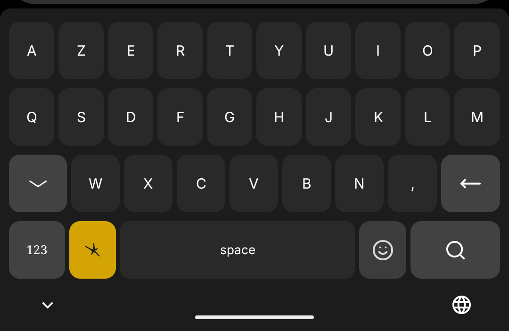
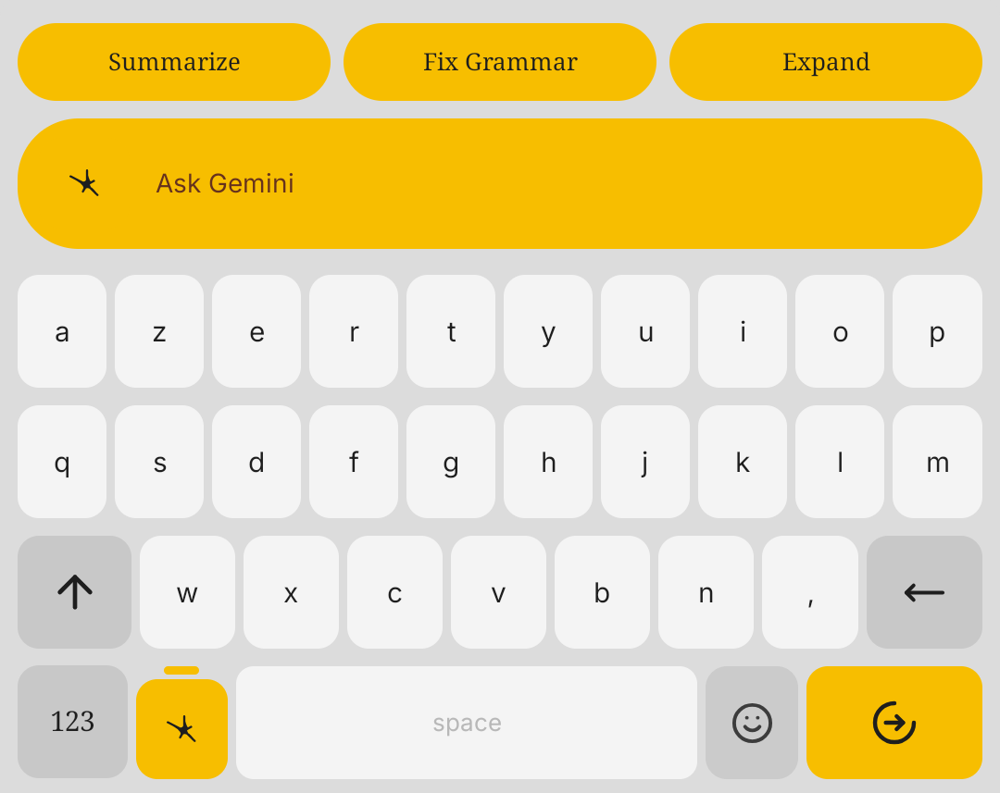
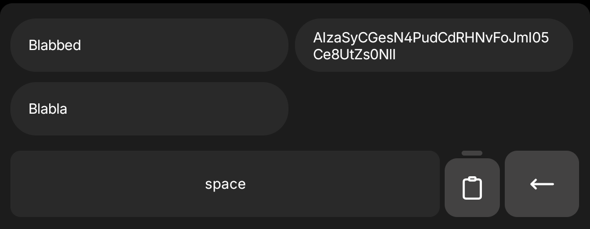
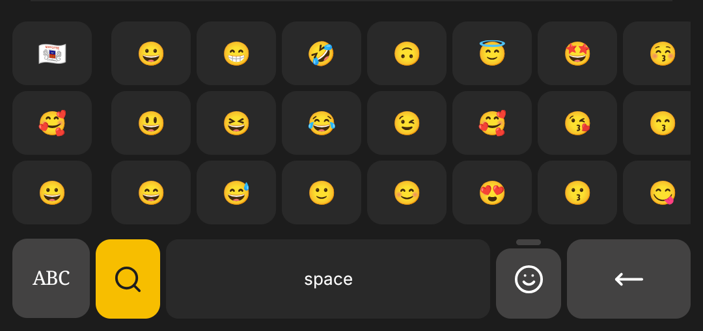

# Nboard

<p align="center">
  
</p>

<p align="center">
  Minimal Android keyboard with AI tools, clipboard power features, emoji search, and fast typing UX.
</p>

<p align="center">
  <a href="https://github.com/MathieuDvv/Nboard/releases">Download APK</a>
  ·
  <a href="#build-locally">Build Locally</a>
  ·
  <a href="#features">Features</a>
</p>

## Screenshots

| Keyboard | AI tools |
|---|---|
|  |  |

| Clipboard | Emoji |
|---|---|
|  |  |

## Features

- AZERTY and QWERTY layouts
- Smart shift behavior (auto-capitalize, one-shot shift, caps lock)
- Local autocorrect (French / English / Both)
- Long-press variants for letters and punctuation
- Spacebar cursor swipe
- Haptics and press animations
- Clipboard history with pin/delete + recent chip for text/images
- Emoji browser + search mode
- AI tools (Summarize, Fix Grammar, Expand, free prompt)
- Contextual action icon based on input field type
- Theme options: `System`, `Light`, `Dark`, `Dark (Classic)`
- Font options: `Inter` / `Roboto`
- Configurable side mode keys (AI / Clipboard / Emoji)

## Install APK (GitHub Releases)

1. Open [Releases](https://github.com/MathieuDvv/Nboard/releases).
2. Download the latest APK from the assets section.
3. Install on device:

```bash
adb install -r path/to/nboard-release.apk
```

4. On Android, enable **Nboard** in keyboard settings.
5. Select **Nboard** as your current keyboard.

## Build Locally

### Requirements

- Android Studio or Android SDK + JDK 17
- `adb` available in PATH

### Build

```bash
./gradlew assembleDebug
```

APK output:

```text
app/build/outputs/apk/debug/app-debug.apk
```

Install debug APK:

```bash
adb install -r app/build/outputs/apk/debug/app-debug.apk
```

## Project Structure

- `app/src/main/java/com/nboard/ime/NboardImeService.kt` — keyboard engine and UI behavior
- `app/src/main/java/com/nboard/ime/MainActivity.kt` — settings app
- `app/src/main/java/com/nboard/ime/OnboardingActivity.kt` — onboarding flow
- `app/src/main/java/com/nboard/ime/KeyboardModeSettings.kt` — persisted preferences
- `app/src/main/java/com/nboard/ime/ai/GeminiClient.kt` — Gemini API client
- `app/src/main/java/com/nboard/ime/clipboard/ClipboardHistoryStore.kt` — clipboard persistence
- `app/src/main/res/layout/keyboard_view.xml` — keyboard layout

## AI Key Setup (Optional)

If you want AI features locally:

1. Copy `local.properties.example` to `local.properties`
2. Add your Gemini key:

```properties
GEMINI_API_KEY=YOUR_API_KEY_HERE
```

You can also set/update the key directly from the app settings.

## Notes

- Behavior depends on host app editor support.
- Image paste support depends on target input accepting rich content.
- Design is heavily inspired by Nothing and its aesthetic.

## License

AGPL-3.0 — see [`LICENSE`](LICENSE).
